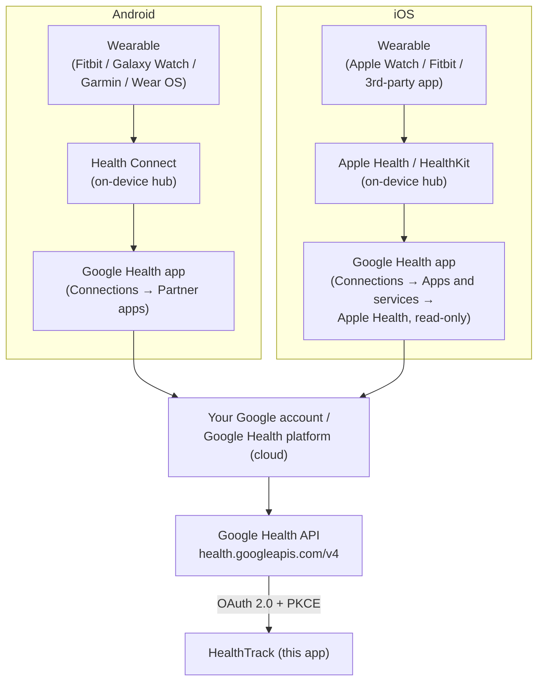

# HealthTrack

A minimal, mobile-first **personal** health dashboard that runs entirely on your
own machine. Live wearable data via the **Google Health API**, an app-derived
**readiness score**, inline and trend **AI insights**, AI food logging (photo,
text, **barcode**, or **USDA**-backed search), custom **habit tracking**,
**macro health goals**, a **profile** with deterministic nutrition/calorie
targets, manual vitals logging, **exercise snacks**, a **live workout session**,
**voice** logging, an **evidence-based, source-traceable coach that learns you**
and **logs on your behalf**, and an optional **Telegram** front-end — all
local-first, with your data stored in plain files next to the app. Installable
as a PWA.

> **Not medical software.** HealthTrack coaches general wellness habits. It does
> not diagnose, treat, or replace a clinician. Built as a personal project.

## Install in one line (demo mode)

No accounts, no API keys, no cloud. You need [Node.js](https://nodejs.org) 20 or
newer and `git`. The installer clones the repo, runs first-run setup, and builds
for production:

**macOS / Linux / WSL / Git Bash**

```bash
curl -fsSL https://raw.githubusercontent.com/mawji/HealthTrack/main/install.sh | sh
```

**Windows (PowerShell)**

```powershell
irm https://raw.githubusercontent.com/mawji/HealthTrack/main/install.ps1 | iex
```

Then start it and open **http://localhost:3210**:

```bash
cd HealthTrack && npm run start
```

With no credentials configured, the app boots straight into **demo mode** —
realistic, deterministic sample data across every screen (Daily, Fitness,
Trends, Food, Habits, Coach, Records) so you can explore the whole UI without
connecting anything.

> **What the installer runs:** it's a small, readable script
> ([`install.sh`](install.sh) / [`install.ps1`](install.ps1)) — `git clone` →
> `npm run setup` → `npm run build`. It never starts a server or writes outside
> the new `HealthTrack/` folder. Piping a remote script to a shell means trusting
> it; read it first if you'd rather, then run the steps below by hand.

Prefer it fully manual:

```bash
git clone https://github.com/mawji/HealthTrack.git
cd HealthTrack
npm run setup     # checks Node, installs deps, creates .env.local + data/
npm run build     # production build
npm run start     # http://localhost:3210
```

> **Working on the code?** Use `npm run dev` instead of `build` + `start` for a
> hot-reloading dev server. For just running the app, prefer the production
> build above — it's faster and is what HealthTrack is meant to run as.

> **Port note:** port 3000 is OS-reserved on some Windows machines, so the app
> runs on **3210**.

## Upgrading

When this repo moves forward, pull the latest code and rebuild in one command —
your `.env.local` and `data/` are gitignored and left untouched:

```bash
npm run upgrade   # git pull (fast-forward) + refresh deps + rebuild
```

Then restart the app (`npm run start`). `npm run upgrade` pulls fast-forward
only, so it never rewrites local work — if you've edited tracked files it stops
and asks you to commit or stash first. (Already have the latest code and just
want a dependency refresh + rebuild? Use `npm run update`.)

## Connecting your own data (all optional)

Everything below is optional. The app is fully usable in demo mode without any
of it. Configure credentials in `.env.local` (created by `npm run setup` from
[`.env.example`](.env.example)) or via the in-app **Settings** page.

### Google Health API — wearable data + food write-back

The Google Health API (`health.googleapis.com/v4`) is Google's replacement for
the legacy Fitbit Web API, which shuts down in September 2026. HealthTrack reads
your wearable data through it over standard Google OAuth 2.0, and writes
nutrition logs back.

#### How the app actually gets your data

Important: this app reads the **cloud Google Health data tied to your Google
account** — it does **not** read your phone's on-device store directly. So your
job is to get your wearable's data *into your Google account*, then point this
app at the Google Health API. The chain looks like this:

```
your wearable
  → (Android) Health Connect on the phone
  → (iOS)     Apple Health on the phone
  → the Google Health app  →  your Google account / Google Health platform
  → Google Health API (OAuth)
  → HealthTrack (this app)
```

On both platforms the **Google Health app** (the rebranded Fitbit app, since May
2026) is the bridge that uploads your phone's health data to your Google
account; the Google Health API then serves that cloud data to HealthTrack.



> Some wearables (notably Fitbit and Pixel Watch) also sync **directly** to your
> Google account through the Google Health app's own cloud — once you've migrated
> your Fitbit account to Google (see below), Health Connect / Apple Health is only
> needed for *other* brands.

#### Fitbit → Google account migration (do this first if you use Fitbit)

If your wearable is a Fitbit or Pixel Watch, migrate your Fitbit account to your
Google account so the device syncs into the Google Health platform. Open the
Fitbit / Google Health app → **Profile / Settings → Move account** and follow the
prompts. Fitbit is hard-requiring this in 2026 (legacy Fitbit logins stop working
mid-May 2026; the Fitbit Web API is decommissioned September 2026), so this is the
only supported path going forward.

#### Android — connect a wearable via Health Connect

Health Connect (Android 9+) is the on-device hub other wearable apps write into;
the Google Health app then uploads it to your Google account.

1. Install **Health Connect** (built in on Android 14+; otherwise from Play
   Store) and the **Google Health** app (the rebranded Fitbit app).
2. Open your wearable's own app (Samsung Health, Garmin Connect, etc.) and enable
   its **Health Connect** integration so it writes your data there. (Fitbit/Pixel
   Watch sync straight to Google — skip to step 4.)
3. In **Google Health → Connections → Partner apps → Sync your favorite health
   apps → Set up**, accept the terms and **choose which data types** to sync
   (steps, heart rate, sleep, weight, nutrition, etc.) and grant background
   access. You manage this later under **Connections → Partner apps → Manage
   Health Connect → Manage data and access**, or in **Health Connect →
   Permissions**.
4. To control *which source* supplies each metric when several apps write the
   same type, open the metric in Google Health and use **View sources** (and
   Health Connect's per-app data priority). This is how you stop, say, two apps
   double-counting steps.
5. Once data is flowing into your Google account, connect this app — see
   [**Google Cloud OAuth setup**](#google-cloud-oauth-setup) below.

#### iOS — connect a wearable via Apple Health

The Google Health API does **not** read Apple HealthKit directly. On iPhone the
realistic path is: your wearable writes into **Apple Health** (HealthKit), and
the **Google Health app reads Apple Health and uploads it to your Google
account**, where the Google Health API can serve it to HealthTrack.

1. Make sure your wearable's app writes to **Apple Health** (most do — Apple
   Watch natively; Fitbit, Garmin, Oura, Whoop, etc. via their iOS app's Apple
   Health permission).
2. Install the **Google Health** app (iOS 16.4+) and sign in with your Google
   account.
3. In **Google Health → Connections → Apps and services → Apple Health → Get
   started**, review the permissions and grant the health-data categories you
   want synced.
4. Connect this app via [**Google Cloud OAuth setup**](#google-cloud-oauth-setup)
   below.

**Honest iOS limitations** (current as of mid-2026):

- The Google Health ↔ Apple Health link is **one-way, read-only** — Google Health
  reads from Apple Health but does not write back yet, so anything HealthTrack
  logs (food, water, workouts) will **not** appear in Apple Health.
- Google Health currently surfaces only about **3 months** of Apple Health
  history.
- A wearable only reaches your Google account if its own iOS app actually writes
  to Apple Health. For a device that syncs **only** to its own vendor cloud and
  never to Apple Health (and isn't Fitbit/Pixel), there is **no clean iOS path**
  into the Google Health API today — that's a genuine gap, not something this app
  can work around.
- For **Fitbit / Pixel Watch** on iOS you don't need Apple Health at all: once
  migrated to your Google account, the device syncs straight to Google Health.

#### Google Cloud OAuth setup

Shared by both platforms — do this once to let HealthTrack call the Google Health
API for your account:

1. Go to <https://console.cloud.google.com> → create (or pick) a project.
2. **APIs & Services → Library** → enable the **Google Health API**.
3. **OAuth consent screen** → External → add your own Google account as a
   **test user** (the Health API scopes are Restricted; test-user mode is fine
   for a personal local app and skips the verification review).
4. **Credentials → Create credentials → OAuth client ID → Web application**,
   authorized redirect URI exactly:
   `http://localhost:3210/api/googlehealth/callback`
5. Put the client ID and secret in `.env.local`, restart `npm run dev`, open the
   app, and tap **connect Google Health** on the Today screen.

Scopes requested: `activity_and_fitness.readonly`,
`health_metrics_and_measurements.readonly`, `sleep.readonly`,
`nutrition.readonly`, `nutrition.writeonly` (plus `activity_and_fitness.writeonly`
for manual workout logging, `health_metrics_and_measurements.writeonly` for
writing weight and body-fat measurements back, and read-only `profile`/`settings`
for the account view). If you connect after a scope was added, **reconnect once**
to grant it.

> **Write-back note:** the Google Health API currently supports
> `dataPoints:create` only for **weight** and **body-fat**. Blood-glucose,
> body temperature, and sleep logged through HealthTrack are stored locally
> only; the API rejects create for those types.

### AI providers — coach + food vision

Connect **any one** provider (or none — coaching simply stays off). Set keys in
`.env.local` or in **Settings → AI Provider**:

- **OpenRouter** (default): `OPENROUTER_API_KEY` from
  <https://openrouter.ai/keys>. The coach model (`OPENROUTER_MODEL`, default
  `openai/gpt-oss-120b`) is pinned to the **Cerebras** provider; the vision model
  (`OPENROUTER_VISION_MODEL`) routes to any provider for food/document photos.
- **OpenAI** (API key or ChatGPT-subscription OAuth), **Gemini**,
  **Anthropic Claude**, or local **Ollama** — all configurable in Settings.

**Voice logging** works without any cloud key: the coach mic button transcribes
on-device with a local Whisper model (Transformers.js, auto-cached to `data/`),
falling back to `gpt-4o-mini-transcribe` (OpenAI key) only if local transcription
fails. Mode is configurable (`auto` / `local` / `cloud`).

### Telegram (optional second front-end)

You can run a single self-hosted, owner-only **Telegram bot** as a second face
to your own coach — chat, log via the same natural-language layer, ask for
metric cards, send **voice notes**, and receive **proactive nudges** (drink
water, finish steps, wind down) and daily/weekly self-reports. It's an outbound
**long-poll bridge** (no inbound webhook, no ports opened): set a bot token in
**Settings → Telegram**, pair your account, and run `npm run telegram:bridge`
(plus `npm run proactive:scheduler` for nudges — both auto-start under
`npm run dev`). You can also share **scoped, default-deny** read-only summaries
with specific contacts (e.g. a trainer's morning activity report) from
**Settings → Sharing**, with per-contact consent, expiry, and an audit log.
Telegram bot messages are not end-to-end encrypted — sharing is opt-in and
owner-initiated.

## Features

| Tab / feature | What it does |
|---|---|
| **Daily** | Steps goal + zone ring, streak, water, workout card, sleep clock + hypnogram, an app-derived **Readiness score** (HRV/RHR/sleep vs your baseline), heart + key-metric rows, your Daily habits, and a pinned **Exercise Snacks** row — plus **inline AI insights by section** (movement, readiness, hydration, sleep, nutrition) for the current day only; opt-in **Goals card** surfacing active macro targets at the top |
| **Fitness** | Workout history with rich capture — type, duration, intensity/effort, soreness, injuries, exercises; a **live "Start a workout" session** (running timer, in-session per-set logging from the wger library, pause/resume/finish, reconcile against a watch-tracked session on finish); a **Training Plan** of upcoming workouts (plan / complete / skip, auto-completed when a matching workout appears); and the Exercise Snacks row |
| **Trends** | Week / month / 90-day / year trends with hover values; **AI summaries per range** (week & month on open, 90-day & year on demand); weight shows latest + low/high; **dynamic metric cards** — a card is added automatically for each active Goal (dashed target overlay), each manually logged vitals kind, and a calorie-target band on "calories in" |
| **Food** | **Photo, text, barcode scan, or USDA food search** → calorie/macro estimate → edit → log to Google Health. Source-backed entries carry a **provenance badge** (USDA FoodData Central / Open Food Facts / AI estimate) and a cited **glycemic index / load** where known; meals logged elsewhere sync back |
| **Habits** | Create custom **boost/avoid** habits (targets, units, icons), log daily, track streaks; surfaced on Daily and in coach context; avoid habits have "Nailed it / I slipped" buttons |
| **Exercise Snacks** | A row of ~9 "breathless minute" circles (the *10 breathless minutes* reframe of 10k steps), pinned on Daily and Fitness; tap a glowing circle to count a snack, with a **suggestion sheet** of anywhere-doable routines and animated demo figures. Resets per local day; logged through the coach and surfaced in its context |
| **Profile** | Sex / DOB / height / weight / activity / goal → deterministic **BMI + category**, healthy-weight range, and **daily calorie + macro/hydration targets** (Mifflin-St Jeor, goal-adjusted, safety-capped). The coach treats these targets as authoritative |
| **Goals** | Set macro health targets (weight, steps, RHR, sleep, fasting glucose, HbA1c, lipids) with deterministic **met / on-track / needs attention** status and progress bars; coach sees all active goals as authoritative context; reach via sidebar on desktop or profile menu on mobile |
| **+ Log** | Floating pill button (desktop) / circle FAB (mobile) — quick-entry popup for **Weight, Glucose, Body temp, Body fat, Muscle mass, Blood pressure, Sleep**; routes Activity / Food / Hydration to their existing screens. Weight and body-fat sync to Google Health automatically |
| **Journal** | View, edit, and delete all hand-logged measurements (newest-first); reach from sidebar / profile menu |
| **Coach** | Streaming chat with inline charts and **persistent conversation history**; logs **workouts, water, food, habits, exercise snacks, and planned workouts** from natural language; **voice input** (mic button → on-device Whisper, cloud fallback); an **evidence-based, source-traceable** mode (USDA / ODPHP / CDC / AHA / GI tables — each recommendation can show its source, metric, and last-reviewed date) with a conservative, clinician-framed health review; and a **memory that learns you** (durable, editable facts — see the **Memory** page). Sees your readiness score, profile targets, active goals, recent measurements, and uploaded records as context |
| **Records** | Upload PDFs/photos/text; AI extracts + summarizes; coach uses them as context |

## Scripts

| Command | What it does |
|---|---|
| `npm run setup` | First-run: check Node, install deps, create `.env.local` + `data/` |
| `npm run dev` | Dev server on `127.0.0.1:3210` (local only) |
| `npm run dev:lan` | Dev server on `0.0.0.0:3210` (reachable from your phone on the LAN) |
| `npm run build` | Production build |
| `npm run start` / `start:lan` | Production server, local-only / LAN-visible |
| `npm run typecheck` | `tsc --noEmit` |
| `npm run check` | Typecheck **and** build |
| `npm run preflight` | Verify Node, deps, and that port 3210 is free |
| `npm run upgrade` | Pull the latest code (fast-forward) **then** refresh deps + rebuild — the command to run when this repo has progressed |
| `npm run update` | Refresh dependencies + rebuild without pulling (leaves `.env.local` and `data/` untouched) |
| `npm run telegram:bridge` | Long-poll bridge for the optional owner Telegram bot (auto-starts under `dev`) |
| `npm run proactive:scheduler` | Deterministic proactive-nudge scheduler for Telegram (auto-starts under `dev`) |
| `npm run backup:data` | Timestamped copy of `data/` into `backups/` |

### Viewing on your phone

Run `npm run dev:lan` (or `start:lan`) and open `http://<your-PC-LAN-IP>:3210`
on your phone, on the same network. The default `dev`/`start` bind to
`127.0.0.1` so the app is not exposed to your network unless you opt in.

### Installing as an app (PWA)

HealthTrack ships a web manifest + icons, so it can be installed to your home
screen / desktop and run full-screen. Browsers only allow install from a
**secure context** (HTTPS, or `localhost`):

- **Same machine (no setup):** open `http://localhost:3210` in Chrome/Edge and
  use the install icon in the address bar. `localhost` counts as secure, so no
  certificate is needed.
- **From your phone:** you need **HTTPS**, easiest with
  [Caddy](https://caddyserver.com) as a reverse proxy. Keep the app local-only
  (`npm run start`) and let Caddy terminate TLS.

  **Install Caddy:**
  - **Windows:** `winget install CaddyServer.Caddy` (or `scoop install caddy`)
  - **macOS:** `brew install caddy`
  - **Linux (Debian/Ubuntu):** follow the apt-repo steps at
    <https://caddyserver.com/docs/install>, or download a static binary from
    <https://caddyserver.com/download>
  - For the **DNS-01** option below you need a *plugin-enabled* build —
    `xcaddy build --with github.com/caddy-dns/<provider>` or tick the plugin on
    the download page.

  Then copy [`Caddyfile.example`](Caddyfile.example) to `Caddyfile`, pick one
  option, set your hostname, and run `caddy run --config ./Caddyfile`:
  - **Real domain, server reachable on 80/443** → Caddy auto-fetches a trusted
    Let's Encrypt cert; the phone installs with no device setup.
  - **Real domain, server not internet-exposed** → use a **DNS-01 challenge**.
    Note the standard Caddy binary has no DNS plugins — build one with your
    provider's plugin (`xcaddy build --with github.com/caddy-dns/cloudflare`, or
    the custom-build option on the Caddy download page), add a DNS API token, and
    point the hostname's A record at the server (a private LAN IP works, set
    "DNS only"). No domain? DuckDNS is a free option. Full steps in
    [`Caddyfile.example`](Caddyfile.example).
  - **Local-only hostname** (e.g. `health.local`) → Caddy's internal CA works,
    but you must install Caddy's root certificate on the phone, or the browser
    shows "Not secure" and blocks install. The root is created only after Caddy
    serves a `tls internal` site once, and lives under Caddy's **data** dir (not
    `/etc/caddy`). Easiest export, via the admin API — Linux/macOS:
    `curl -s http://localhost:2019/pki/ca/local | jq -r .root_certificate > caddy-root.crt`;
    Windows PowerShell (no jq/curl):
    `(Invoke-RestMethod http://localhost:2019/pki/ca/local).root_certificate | Set-Content -Encoding ascii caddy-root.crt`.
    Then install it on the phone. Details in [`Caddyfile.example`](Caddyfile.example).

  If you connect Google Health through the HTTPS hostname, add
  `https://<host>/api/googlehealth/callback` as an authorized redirect URI too.

  > HealthTrack ships both SVG and PNG icons (192 × 192, 512 × 512, maskable,
  > and 180 × 180 apple-touch), so install works cleanly on Android and iOS.
  > An offline service worker is planned.

### Running in the background (optional)

This is a local-first personal app, not a hosted service. To keep it running
after login:

- **Windows** — Task Scheduler: create a task that runs `npm run start` in the
  project folder at logon.
- **macOS** — `launchd`: a user `LaunchAgent` plist running `npm run start` at
  login.

Full service installers are intentionally deferred for this limited release.

## Storage & privacy

Everything lives in `data/` next to the app (gitignored): OAuth tokens, food
log, manually logged measurements, goals, medical-record files and summaries,
cached insights. Nothing leaves your machine except the API calls **you**
configure (Google Health, your chosen AI provider). No telemetry, no analytics,
no third-party hosting.

## Requirements

- **Node.js 20 or newer** (tested on LTS lines 20, 22, and 24).
  `better-sqlite3` is a native module that needs a current Node with prebuilt
  binaries; the `engines` field in `package.json` enforces the minimum.

## Architecture

- **Next.js 15 (App Router) + React 19**, TypeScript, no UI framework — the
  design system is ~200 lines of CSS variables.
- API routes under `app/api/*`: `googlehealth/*` (OAuth 2.0 + PKCE,
  auto-refresh), `health` (aggregation + demo fallback), `food/*`
  (analyze / search / barcode / log), `water`, `workouts`, `workout-plans`
  (training plan), `workout-session` (live session), `exercise-snacks`,
  `exercise-library` (wger), `habits/*`, `goals` (macro health targets CRUD +
  progress), `profile` + `nutrition/targets` (deterministic calorie/macro
  targets), `measurements` (manual vitals log + Google Health write-back),
  `devices` (paired device list + local relabelling), `daily-insights`
  (today's section insights + readiness), `transcribe` (local-first voice),
  `chat` (streaming coach + natural-language logging), `coach/*`
  (insights / memory / conversations / questions), `telegram/*` + `proactive/*`
  (optional owner bot, nudges, scoped sharing), `records`.
- The **readiness score** is derived in `lib/readiness.ts` (HRV/RHR/sleep vs a
  personal rolling baseline — see
  [`docs/readiness-scoring.md`](docs/readiness-scoring.md)); the deterministic
  daily section-insight gate lives in `lib/daily-insights.ts`.
- `lib/goals.ts` holds all 9 macro goal definitions, deterministic status
  computation (`statusFor`/`progressFor`), and the coach-visible summary.
  `lib/measurements.ts` manages hand-logged vitals and the Google Health
  write-back (weight + body-fat only — the API rejects create for other types).
  `lib/devices.ts` reads paired devices and applies local display-name overrides.
- `lib/profile.ts` + `lib/coach/nutrition-targets.ts` hold the profile store and
  the deterministic Mifflin-St Jeor → TDEE → goal-adjusted target math;
  `lib/evidence/` + `lib/coach/*` carry the source-traceable coaching rules
  (exercise, prevention, evidence cards), with food provenance from `lib/usda.ts`,
  `lib/openfoodfacts.ts`, and `lib/glycemic-index.ts`. `lib/training-plan.ts`,
  `lib/workout-session.ts`, `lib/exercise-library.ts` (wger), and
  `lib/exercise-snacks.ts` + `lib/snack-routines.ts` back the Fitness surfaces;
  `lib/transcribe.ts` does local-first voice; `lib/telegram/*` and
  `lib/proactive/*` power the optional Telegram channel (the `filterForContact`
  choke point in `lib/telegram/sharing.ts` is default-deny).
- `lib/googlehealth.ts` is the only file that talks to the Google Health API;
  the AI provider layer in `lib/ai-provider.ts` is the only one that talks to
  the models. `lib/demo.ts` generates the demo-mode dataset.

## License

[MIT](LICENSE) © 2026 Shams Mawji.
